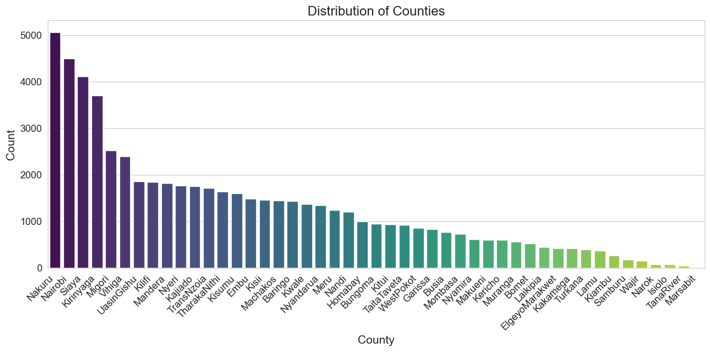
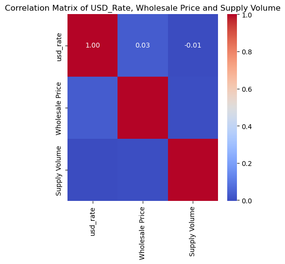
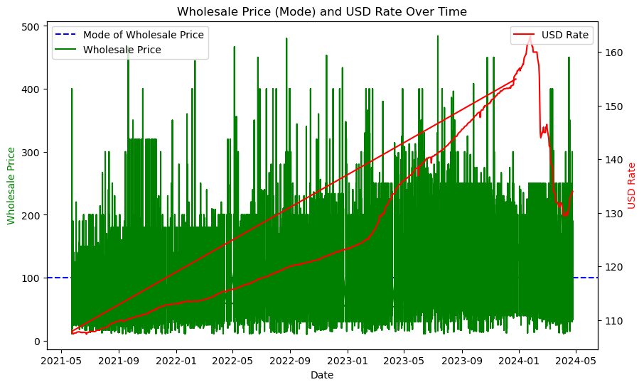

# Crop Price Prediction 
This project analyzes wholesale food prices in Kenya, specifically for various crops across different markets and counties. The goal is to gain insights into the trends and patterns of food prices over time and across different regions.

## Table of Contents

- [FEATURES](#FEATURES)
- [INTRODUCTION](#INTRODUCTION)
- [BUSINESS UNDERSTANDING](#BUSINESS-UNDERSTANDING)
- [STAKEHOLDERS](#STAKEHOLDERS)
- [PROBLEM STATEMENT](#PROBLEM-STATEMENT)
- [OBJECTIVES](#OBJECTIVES)
- [DATA DESCRIPTION](#DATA-DESCRIPTION)
- [DATA PREPROCESSING](#DATA-PREPROCESSING)
- [ANALYSIS AND VISUALIZATION](#ANALYSIS-AND-VISUALIZATION)
- [USAGE](#USAGE)
- [INSTALLATION](#INSTALLATION)
- [CONTRIBUTING](#CONTRIBUTING)
- [AUTHORS](#AUTHORS)

## FEATURES
- Data cleaning and preprocessing
- Exploratory data analysis (EDA)
- Feature engineering
- Outlier detection and removal
- Data visualization
- Machine learning model

## INTRODUCTION
At Datawise Solutions, we specialize in offering cutting-edge data analytics and consulting services to help organizations of all sizes use the value of their data. With a team of professional data scientists, analysts, and consultants, we are committed to assisting organizations in gaining important insights, making educated decisions, and driving growth.

Our objective is straightforward: turn raw data into actionable intelligence. Whether you want to streamline operations, improve marketing tactics, improve customer experiences, or drive innovation, we have the knowledge and technology to help you convert data difficulties into opportunities.

From data collecting and cleansing to advanced analytics and predictive modeling, we provide a full portfolio of services that are tailored to your individual requirements. Our collaborative approach guarantees that we understand your specific business objectives and create solutions that produce demonstrable outcomes.

Datawise Solutions believes that the power of data is infinite. Let us be your reliable partner on the path to data-driven success.

Explore the possibilities with Datawise Solutions today!

## BUSINESS UNDERSTANDING 
According to a Business Daily article, Kenyan farmers earn less even while consumers pay more for food products since there is a significant price difference between farmers' and consumer pricing. Kenyan farmers' commodity prices are influenced by an inefficient market structure and intermediaries between producers and buyers. It is highlighted that middlemen determine market dynamics, resulting in divergent wholesale and retail prices in Kenyan markets. However, external variables such as subsidy schemes and currency fluctuations have influenced farmers' commodity prices, yet farmers continue to earn less than the market price established in Kenyan stores and markets.

According to the KARI research, agricultural productivity is declining due to limited market access.

## STAKEHOLDERS

1.Kenya Farmers Association

2.Small-scale Farmers

3.Government Agencies (e.g., Ministry of Agriculture, Central Bank of Kenya)

4.Agricultural Traders and Middlemen

5.Financial Institutions

6.Consumers

## PROBLEM STATEMENT
Farmers in Kenya frequently face huge differences between the prices they receive for their commodities and the amounts consumers pay in marketplaces. This disparity is mostly caused by inefficient market systems and the presence of intermediaries that profit from pricing inconsistencies. As a result, farmers struggle to obtain reasonable rates for their produce, despite the fact that agriculture is an important component of the country's GDP and a source of income for many people. To address this issue, a complete price forecasting system that uses historical and real-time data, as well as machine learning models, is urgently needed. Such a technology would provide farmers with forecast pricing updates, improve market transparency, and allow all players in the agricultural value chain to make informed decisions.
## OBJECTIVES 
Creating machine learning models to forecast crop output pricing using variables such as location, time, supply dynamics, and currency fluctuations.
Developing a user-friendly interface for farmers to receive predicted pricing updates and market segmentation data.

Using historical agricultural commodity prices and CBK currency data to create accurate forecasting models.

Farmers will receive training and support in order to efficiently use the price forecasting system.

## DATA DESCRIPTION
The dataset contains the following columns:
- Date: The date of the exchange rate data.
- Price: The closing price of USD to KES exchange rate on that date.
- Open: The opening price of USD to KES exchange rate on that date.
- Low: The lowest price of USD to KES exchange rate on that date.
- Volume: Volume of USD to KES exchange transactions (seems to be mostly NaN values).
- Change %: Percentage change in the USD to KES exchange rate from the previous day.
- Product: Type of food product.
- Market Location: Location of the market where the product is sold.
- Wholesale Price: Wholesale price of the product.
- Supply Volume: Volume of supply for the product.
- County: County where the market is located.
- Date: Date of the record.
- USD Rate: USD exchange rate.
- Additional engineered features: Ratio of supply volume to wholesale price, one-hot encoded product and market location, date-time features, lag features, rolling window statistics, and differenced features.

## DATA PREPROCESSING
The preprocessing steps include:

- Cleaning the data by removing outliers and irrelevant entries
- Feature engineering to create new features like supply volume ratio and one-hot encoding
- Handling missing values and converting data types
- Extracting date-time features and creating lag features
- Normalizing numerical features

## ANALYSIS AND VISUALIZATION
The analysis and visualization techniques employed in this project include:

- Boxplots to visualize price distributions by product and county
- Scatter plots to explore relationships between price, supply volume, and USD rate
- Line charts to visualize trends over time for price and USD rate
- Statistical analysis to identify correlations and trends

The correlation heatmap shows the correlation coefficients between the variables 'usd_rate', 'Wholesale Price', and 'Supply Volume'. Here's what each correlation coefficient represents:

usd_rate vs. Wholesale Price: This correlation coefficient indicates the linear relationship between the exchange rate of USD and the wholesale price of the products. A positive value suggests a positive correlation, meaning that as the USD rate increases, the wholesale price tends to increase as well. Conversely, a negative value suggests a negative correlation.

usd_rate vs. Supply Volume: This correlation coefficient indicates the linear relationship between the exchange rate of USD and the supply volume of the products. Similarly, a positive value suggests a positive correlation, meaning that as the USD rate increases, the supply volume tends to increase as well. A negative value suggests a negative correlation.

Wholesale Price vs. Supply Volume: This correlation coefficient indicates the linear relationship between the wholesale price and the supply volume of the products. Again, a positive value suggests a positive correlation, meaning that as the wholesale price increases, the supply volume tends to increase as well. A negative value suggests a negative correlation.

The values range from -1 to 1, where:

-1 indicates a perfect negative correlation,

0 indicates no correlation, and

1 indicates a perfect positive correlation.

**#MODELLING**

For this project we explored the following models:

     1.Linear Regression 
     
     2.Forest modeling 
     
     3.XGBoost model 
     
     4. Decision Tree
XGBoost model outperformed Linear Regression, Random Forest, and Decision Tree Model showcasing its effectiveness in this analysis.

Note: The code for the models can be found in the  notebooks folder.

##CONCLUSION AND RECOMMENDATIONS

In conclusion, this project has successfully achieved its objectives of developing a comprehensive price forecasting system for the Kenyan agricultural market. Through the implementation of machine learning models and strategic analysis, we have empowered farmers with predictive pricing updates and enhanced market transparency. Our focus on strategic crops has provided valuable insights into market dynamics and opportunities for growth. Moving forward, we are poised to continue driving positive change within the agricultural sector, promoting resilience and sustainability for farmers and stakeholders alike.

##RECOMMENDATIONS

Based on our analysis and findings, we recommend the following actions:

1.Implementation of Predictive Pricing System: Deploy the developed machine learning models to provide farmers with predictive pricing updates, enabling them to make informed decisions regarding resource allocation and market positioning.

2.Enhanced Market Transparency: Collaborate with government agencies and agricultural traders to promote market transparency and fair pricing practices, thereby reducing the influence of intermediaries and ensuring farmers receive fair prices for their produce.

3.Continuous Monitoring and Evaluation: Regularly monitor and evaluate the performance of the price forecasting system to ensure accuracy and relevance. Incorporate feedback from stakeholders to improve the system's effectiveness over time.

## USAGE
1. Clone the repository.

          git clone git@github.com:pseudocmd/Phase5-project.git
3. Install the required dependencies.
4. Run the Jupyter Notebook or Python script to execute the code.
5. Follow the instructions and comments in the code for specific tasks or analyses.

## INSTALLATION
To run the code in this project, you'll need:
- Python 3
- numpy
- matplotlib
- seaborn
- scikit-learn

You can install the dependencies using pip:

      pip install pandas numpy matplotlib seaborn scikit-learn

## CONTRIBUTING
We welcome contributions from the community. If you'd like to contribute to this project, please follow these steps:

### Fork the repository.
1. Create a new branch for your feature:

        git checkout -b feature-name.
   
2. Make your changes and commit them:
 
       git commit -m 'Add feature-name'.
3. Push to the branch:
  
       git push origin feature-name.
   
4. Create a pull request.

## AUTHORS
- Milton Kabute
- Collins Cheruiyot
- Thorne Makau
- Joyce Muthiani
- Kenneth Karanja
- Amina Hagi
